# 🩺 *Sehat 360 - Revolutionizing Personal Health Management*

*Sehat 360* is your all-in-one health companion app that provides instant AI-driven health insights, personalized lifestyle guidance, and real-time access to nearby healthcare services. Designed to make healthcare immediate, personalized, and accessible, Sehat 360 empowers users to take charge of their well-being with confidence and clarity.

---

# 🚀 *Key Features*

## 🔍 *Instant Health Predictions & Diagnosis*

**Joint X-ray Analysis**  
* Upload your knee X-ray and receive an AI-based severity assessment along with expert recommendations for treatment and care.

**Diabetes & Heart Attack Risk Prediction**  
* Instantly assess your risk levels based on your health inputs and receive proactive health advice.

---

## 🧠 *Real-Time Personalized Guidance*

* After prediction, get customized lifestyle tips, diet suggestions, and exercises tailored to your health condition.  
* Easily understand what steps to take next to manage or prevent health issues.

---

## 🏥 *Nearby Hospitals & Doctors*

* Find hospitals and doctor departments based on your live location.  
* View doctor specializations, OPD schedules, and clinic contact details.  
* Navigate to medical centers with built-in map directions for faster access during emergencies.

---

# ✅ *How It Helps*

## 💡 *Makes Tasks Easier*

* **Early Diagnosis**: Detect joint issues, diabetes, and heart attack risks before symptoms escalate.  
* **Personalized Health Support**: Receive AI-powered health suggestions and daily management strategies.  
* **Emergency Access**: Quickly locate healthcare facilities without confusion or delay.  
* **Health Organization**: Manage your medications, appointments, and wellness tips in one place.

---

## 🔐 *Makes Healthcare Safer*

* **Early Detection & Prevention**: Reduce risk with timely alerts and guidance.  
* **Quick Access in Emergencies**: Locate the right care at the right time.  
* **AI-Driven Insights**: Make safer, data-backed decisions for your health.

---


# 📱 *Screenshots*

Explore the app's interface with these screenshots:

#### Home Screen
| Home Screen | 
|--------------|
| 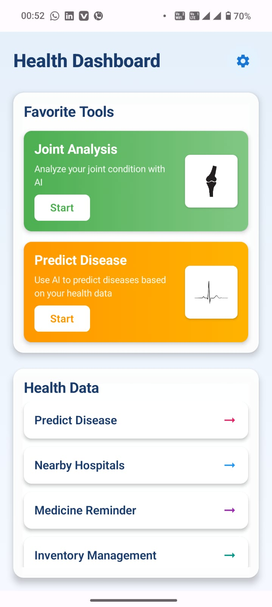 |

#### Prediction Screens

| Knee Severity Prediction Screen | Knee AI Guidence | 
|------------------|---------------|
| 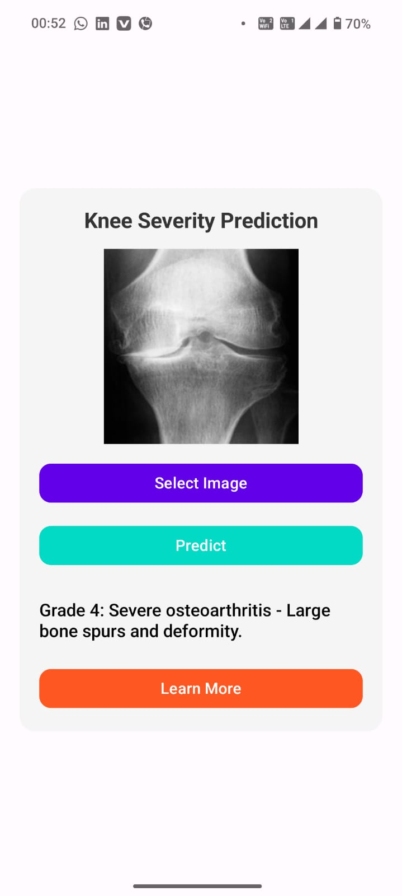 | 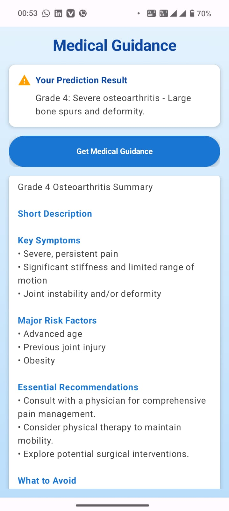 |


| Choose What to Predict Screen |
|----------------|
| 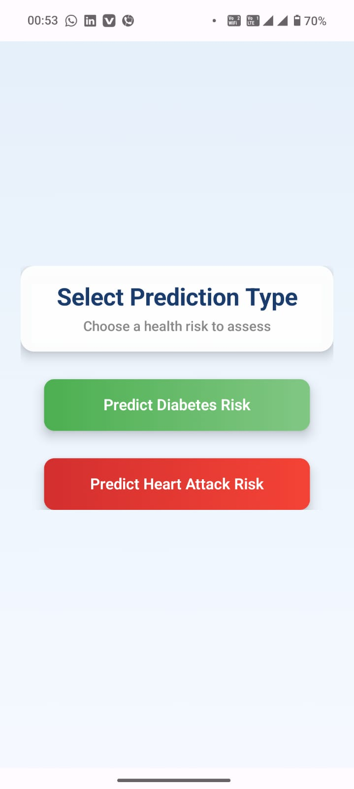 |


| Diabetes Prediction | Diabetes Results |
|--------------------|------------------|
| 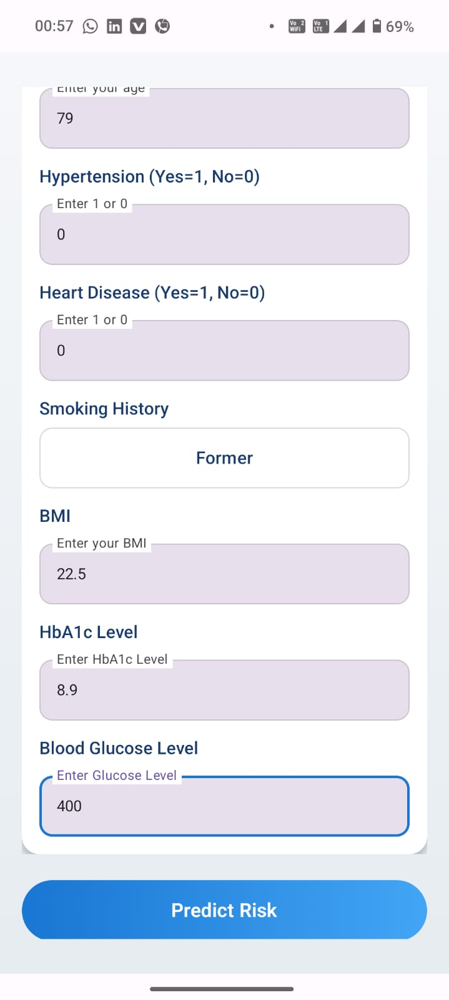 | 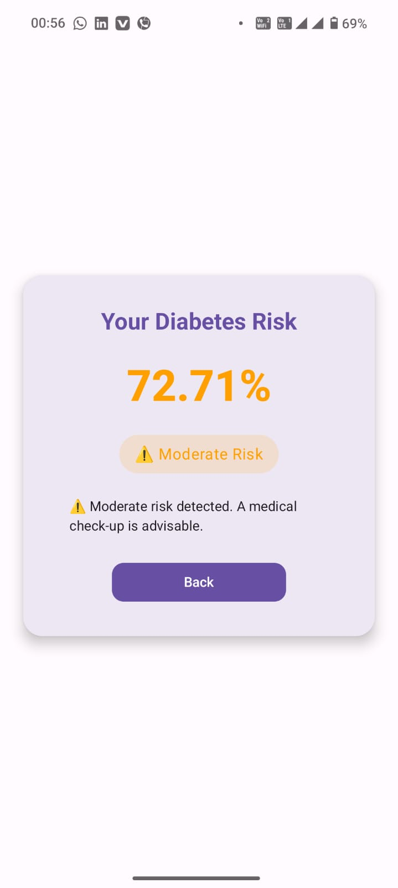 | 


| Heart Prediction | Heart Results |
|--------------------|------------------|
| 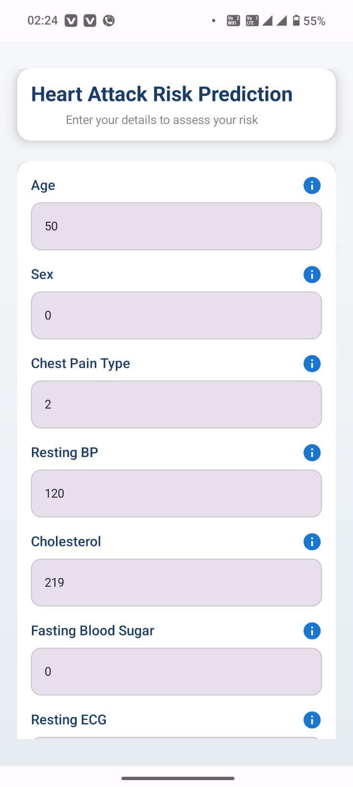 | 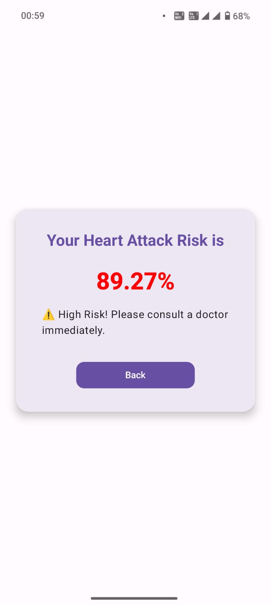 | 


#### Hospital/Doctor Screens
| Nearby Hospital | Direction Screen | Select Your Department | Doctor List | OPD Screen |
|-----------------|------------------|------------------------|-------------|------------|
| 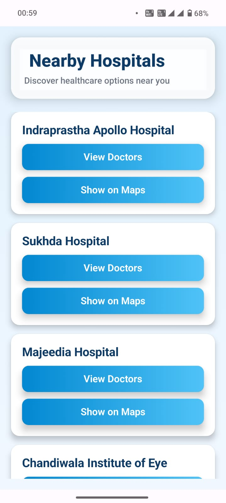 | 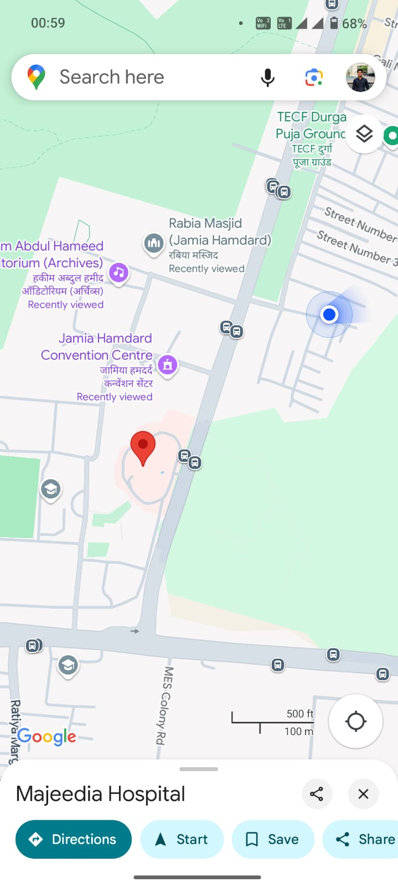 | 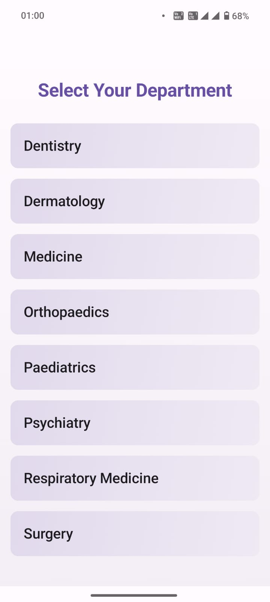 | 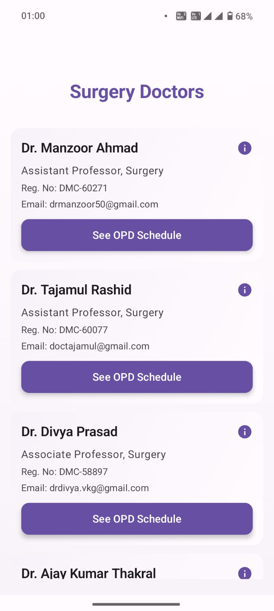 | 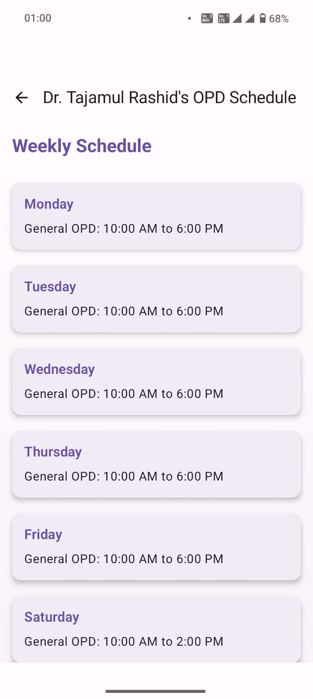 |


#### Coming Soon Features
| Hospital Coming Soon | Home Coming Soon Screen |
|----------------------|-------------------------|
| 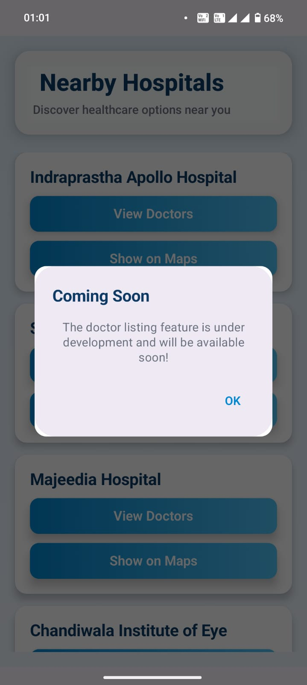 | 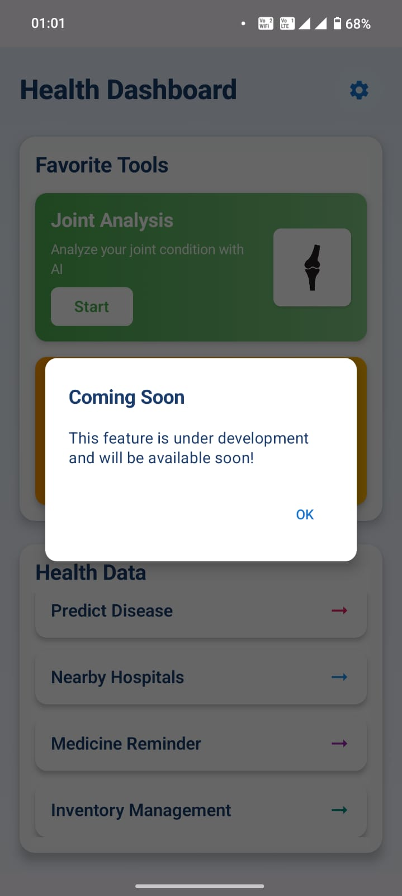 |


---

# 🎥 *Video Demo*

👉 [Watch Demo Video](https://youtu.be/1LMFzxmKPJU?si=pVMvdzEq0R7hO0mD)

---

# 📥 *Download the App*

📲 [Download Sehat 360 APK](https://drive.google.com/file/d/1LXS2WXAyFrobXr7C5n83d10b0Qn8Q3nm/view?usp=sharing)

---
# 📦 *Tech Stack*

* **Jetpack Compose** – UI framework for modern Android development  
* **Kotlin** – Programming language used  
* **MVVM Architecture** – Ensures clean and maintainable code  
* **Retrofit** – For API calls and network communication  
* **Google Maps API** – For location-based hospital and doctor tracking  
* **TensorFlow Lite** – For running machine learning models on Android  

---

# 🧠 *AI & Machine Learning*

* **Python** – Used for training and developing machine learning models  
* **Algorithms Used**:  
  * **SVM (Support Vector Machine)** – For classification tasks  
  * **Linear Regression** – For health-related risk prediction  
  * **ResNet (Deep Learning)** – For image-based knee X-ray severity analysis  

---

# 👥 *Target Users*

* Individuals with chronic conditions like diabetes or joint pain  
* Anyone looking to proactively monitor their health  
* Elderly users needing quick healthcare access  
* Emergency patients looking for fast and accurate doctor/hospital info

---

# 🔮 *Future Scope*

* Integration with **wearable devices** for real-time health analysis and predictions  
* Full-fledged **medicine reminder** and **inventory management system**  
* Comprehensive **hospital database** with doctors, departments, and live availability data

---


# 🛠️ *Installation (For Developers)*

```bash
git clone https://github.com/your-org/sehat360.git
cd sehat360
# Open in Android Studio and run on a connected device or emulator.
```

---

# 👨‍💻 *Developed by*

**Team - Wellness Wizards**  
*Empowering healthcare with technology.*

---

# 🔖 *Hashtags*

#AMUHACKS4.0 #CSSAMU #AMU
